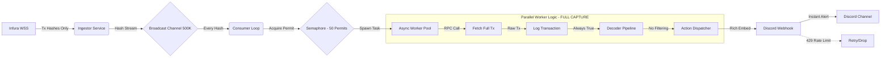

# Protocol Specification: The Mempool Sniper

**Version:** 2.0.0-full-capture
**Classification:** Real-Time Network Traffic Monitor / Complete Analytics Engine
**Architecture:** Event-Driven / Parallel Pipeline / Zero-Filter Capture
**Language:** Rust 2021
**Status:** Production (Full Capture Mode)

---

## 1. Executive Summary

The **Mempool Sniper** is a high-velocity transaction monitoring system designed for the Ethereum ecosystem (currently deployed on **Sepolia Testnet**). Originally designed as an active MEV searcher with selective filtering, the system has evolved into a **Complete Network Traffic Monitor** operating in **Full Capture Mode** - ingesting and alerting on 100% of network transactions with zero filtering.

The system ingests pending transactions via WebSocket, processes ALL transactions through a parallel worker pool, and broadcasts every single event to Discord webhooks for real-time network visibility. It features a custom **Parallel Fetching Engine** (50 concurrent workers) to overcome the rate-limit and latency constraints of free-tier RPC providers (Infura).

**Key Evolution:** The system has transitioned from selective whale-hunting to comprehensive network monitoring, capturing transactions of all values (including 0 ETH), all methods (including Unknown), and all addresses (no whitelist/blacklist).

## 2. Design Philosophy & Invariants

1. **Complete Capture > Selective Filtering:** Operating in **Full Capture Mode** - the system processes 100% of mempool transactions with zero filtering. No value thresholds, no method whitelists, no address restrictions. Every transaction is captured, decoded, and alerted.
2. **Freshness > Completeness:** Despite full capture, the system still prioritizes tip-of-mempool freshness. If the processing buffer fills up, oldest transactions are dropped to ensure current transactions are always processed first.
3. **Concurrency > Raw Speed:** Due to the limitations of remote RPCs (network hops), the system prioritizes **Async Parallelism** (50 concurrent workers) over single-threaded raw speed.
4. **Fail-Open Architecture:** A failure in decoding, fetching, or alerting for a single transaction must never crash the pipeline. The system logs the error and immediately processes the next frame.
5. **Observable Streaming:** Every transaction is logged with `🚀 Processing tx: 0x...` to provide real-time visibility into the capture stream's health.

---

## 3. System Architecture

The system implements a **Producer-Consumer** pattern with a Semaphore-bounded worker pool to manage external rate limits.

### 3.1 High-Level Data Flow



**Key Changes from Selective Mode:**
- **Stage 1 (Selector Check):** REMOVED - All transactions pass unconditionally
- **Stage 2 (Value Check):** REMOVED - Even 0 ETH transactions are processed
- **Logging:** Every transaction is logged with tx hash for stream visibility
- **Rate Limiting:** Discord webhooks hit 429 errors frequently due to volume

### 3.2 The Threading Model

* **Ingestor Task:** Dedicated strictly to reading `TxHash` frames from the WebSocket. Pushes to a `tokio::sync::mpsc` channel (Capacity: 500,000).
* **Consumer Task:** A specialized loop that manages a `Semaphore` (Limit: 50 permits). It does *not* await tasks; it spawns them immediately and continues polling the channel.
* **Worker Tasks:** Short-lived async tokio tasks that perform:
  1. I/O: `get_transaction_by_hash()` RPC call
  2. Logging: `info!("🚀 Processing tx: {:?}", tx_hash)`
  3. CPU: Transaction decoding (extracts method, value, addresses)
  4. I/O: Discord webhook POST request

**Concurrency Control:**
- Semaphore prevents overwhelming Infura's RPC rate limits (max 50 concurrent requests)
- Each worker task holds a permit for its entire lifecycle
- Permit is automatically released via RAII when task completes or panics

---

## 4. Subsystem Specifications

### 4.1 The Ingestion Engine ("The Eye")

* **Protocol:** WebSocket (`wss://...`) via `alloy::providers`.
* **Provider Strategy:** **Infura Free Tier** (Sepolia).
* **Constraint:** Infura WSS only provides *hashes*, not full transaction objects. This necessitates the "Fetch-on-Demand" architecture described in 3.1.
* **Resiliency:** Auto-reconnect logic handles the unstable nature of free-tier WebSockets, logging "Lagged" errors as debug noise rather than critical failures.

### 4.2 The Decoding Pipeline ("The Brain")

**Current Mode: FULL CAPTURE - Zero Filtering**

The pipeline has been completely opened to accept ALL transactions for comprehensive network monitoring.

**Stage 1: The Gatekeeper (DISABLED)**

* **Original Logic:** Checked `calldata[0..4]` against a hardcoded set of swap selectors
* **Current Implementation:** `is_target_transaction(_input_data: &[u8]) -> bool { true }`
* **Behavior:** Returns `true` unconditionally for:
  * Native ETH Transfers (empty calldata)
  * All contract calls (any selector)
  * Unknown methods
  * Malformed transactions
  * Every transaction without exception

**Supported Protocol Detection (For Labeling Only):**
* **Uniswap V2:** `swapExactETHForTokens`, `swapExactTokensForETH`, `swapExactTokensForTokens`
* **Uniswap V3:** `exactInputSingle`, `exactInput`, `multicall`
* **Universal Router:** `execute`
* **Native:** Empty Calldata (labeled "Native Transfer")
* **Unknown:** Any unrecognized selector (labeled "Unknown")

**Stage 2: The Value Heuristic (DISABLED)**

* **Original Logic:** Filtered transactions below 0.0001 ETH threshold
* **Current Implementation:** No threshold check - processes all values
* **Behavior:** Accepts:
  * 0 ETH transactions
  * 0.0001 ETH transactions
  * 10+ ETH whale transactions
  * Everything in between

**Effective Value Calculation (Still Applied):**
```rust
effective_value = max(tx.value, decoded_amountIn)
```
* **Reasoning:** WETH swaps often have `tx.value = 0`. The decoder extracts the `amountIn` parameter from the calldata to reveal the true economic value.
* **Usage:** Used for display in alerts, not for filtering

### 4.3 The Action Engine (The Pivot)

* **Old Strategy:** Flashbots Bundle Submission (Deprecated due to auth complexity and strategic pivot).
* **Current Strategy:** **Discord Webhook Real-Time Alerts**.

**Implementation Details:**

**Primary Binary: `mempool-sniper`**
* **Module:** `src/discord.rs`
* **Struct:** `DiscordClient { webhook_url: String, client: reqwest::Client }`
* **Trait:** Implements `SniperAction` trait for drop-in polymorphism
* **Method:** `async fn execute(&self, tx: &TargetTransaction) -> Result<()>`

**Discord Embed Payload:**
```rust
{
  "embeds": [{
    "title": "🚨 Whale Alert / Sniper Target",
    "color": 0x00ff00,  // Green
    "fields": [
      { "name": "💰 Value", "value": "10.5 ETH", "inline": true },
      { "name": "📊 Method", "value": "`swapExactETHForTokens`", "inline": true },
      { "name": "🔗 Transaction", "value": "[0x1234...cdef](https://sepolia.etherscan.io/tx/0x...)" },
      { "name": "📤 From", "value": "`0xd8da...6045`", "inline": true },
      { "name": "📥 To", "value": "`0xc02a...6cc2`", "inline": true },
      { "name": "⏰ Detected", "value": "<t:1707421428:R>" }  // Discord relative timestamp
    ],
    "footer": { "text": "Mempool Sniper • Real-Time Monitor" },
    "timestamp": "2026-02-08T18:36:29Z"
  }]
}
```

**Key Features:**
- **Etherscan Links:** Transaction hashes are clickable links to Sepolia Etherscan
- **Relative Timestamps:** Discord's `<t:unix:R>` format shows "5 seconds ago"
- **Address Formatting:** EIP-55 checksummed addresses for copy-paste safety
- **Method Labeling:** Displays decoded method name or "Unknown" for unrecognized selectors
- **Immediate Firing:** Alert sent the moment transaction is detected (sub-second latency)

**Rate Limiting Behavior:**
- Discord webhooks have a ~30 requests/minute soft limit
- System encounters frequent `429 Too Many Requests` errors in Full Capture Mode
- Failed alerts are logged but don't crash the pipeline (Fail-Open architecture)

**Test Harness Binary: `test_notification`**
* **Location:** `src/bin/test_notification.rs`
* **Purpose:** Standalone test script for Discord integration
* **Functionality:**
  - Loads `DISCORD_WEBHOOK_URL` from `.env`
  - Creates a fake `TargetTransaction` (10.5 ETH whale swap)
  - Sends test alert to Discord channel
  - Usage: `cargo run --bin test_notification`
* **Use Cases:**
  - Verify webhook configuration without waiting for blockchain events
  - Test embed formatting and styling
  - CI/CD integration testing
  - Demo alerts to stakeholders


---

## 5. Data Structures

### 5.1 Core Transaction Model

```rust
pub struct TargetTransaction {
    pub tx_hash: TxHash,           // Transaction identifier
    pub from: Address,              // Sender address
    pub to: Address,                // Recipient/contract address
    pub value: U256,                // Effective value (max of tx.value or amountIn)
    pub method: String,             // Decoded method name or "Unknown"
    pub amount_out_min: U256,       // Minimum output for swaps
    pub path: Vec<Address>,         // Token swap path (e.g., [WETH, USDT])
    pub deadline: U256,             // Transaction deadline timestamp
    pub detected_at: u64,           // Unix timestamp (ms) when detected
}
```

**Field Details:**
- `from`: Added to track transaction originators for whale identification
- `detected_at`: Added to measure detection-to-alert latency
- `value`: Stores the "effective" value (accounts for WETH swaps with tx.value=0)

### 5.2 Module Structure

The codebase is organized as a library with binary targets:

**Library (`src/lib.rs`):**
```rust
pub mod action;     // Trait definitions and action implementations
pub mod decoder;    // Transaction decoding and selector matching
pub mod discord;    // Discord webhook client
pub mod ingestor;   // WebSocket subscription management
```

**Binaries:**
- `src/main.rs` - Primary mempool monitoring daemon
- `src/bin/test_notification.rs` - Discord webhook test harness
- `src/bin/auth_test.rs` - Flashbots authentication diagnostic (deprecated)

---

## 6. Completed Implementation Roadmap

### ✅ Phase 1: Foundation

* Project initialized with `alloy`, `tokio`, `serde`.
* Connected to Sepolia WSS.
* Established producer-consumer architecture.
* **Status:** Complete.

### ✅ Phase 2: The "Broken" Pipeline

* Attempted single-threaded processing.
* **Lesson Learned:** Single-threaded fetching on Infura lags by seconds due to network I/O.
* **Fix:** Refactored to Parallel Worker model with semaphore-bounded concurrency.

### ✅ Phase 3: The Crypto Hardening (Flashbots Era)

* Implemented correct EIP-191 signing logic (Hash-then-Sign pattern).
* Discovered and fixed critical bug: Checksummed addresses (EIP-55) rejected by Flashbots relay.
* Implemented "Paranoid" hex formatting (strict lowercase `{:x}` instead of `{:#x}`).
* Created `auth_test.rs` diagnostic binary to isolate signing vs. authorization issues.
* **Outcome:** Cryptographic signing verified correct, but relay authorization failed (likely key not whitelisted).
* **Decision:** Deprecated Flashbots integration in favor of monitoring strategy.

### ✅ Phase 4: The Strategic Pivot (Discord Integration)

* Replaced execution logic with real-time monitoring and alerting.
* Integrated `reqwest` with JSON features for Discord webhooks.
* Created `DiscordClient` implementing `SniperAction` trait for polymorphism.
* Developed rich embed format with Etherscan links, relative timestamps, and colored alerts.
* Created `test_notification.rs` binary for webhook validation.
* **Status:** Complete and Production-Ready.

### ✅ Phase 5: Full Capture Mode (Current)

* **Removed all filtering logic:**
  - Disabled selector-based gatekeeper (accepts all methods)
  - Removed ETH value threshold (accepts 0 ETH transactions)
  - No address whitelisting/blacklisting
* **Enhanced observability:**
  - Added per-transaction logging: `🚀 Processing tx: 0x...`
  - Transaction count metrics every 100 txs
* **Extended data model:**
  - Added `from` field to `TargetTransaction`
  - Added `detected_at` timestamp field
* **Performance characteristics:**
  - Processes 100% of Sepolia mempool traffic
  - Encounters Discord rate limiting (429 errors) due to volume
  - System remains stable via fail-open error handling
* **Status:** Operational - Full network visibility achieved.

---

## 7. Technical Stack (Current)

| Component | Technology | Version | Reasoning |
| --- | --- | --- | --- |
| **Language** | Rust | 2021 Edition | Zero-cost abstractions, memory safety, fearless concurrency. |
| **Async Runtime** | `tokio` | 1.42 | Industry standard for I/O heavy applications, mature ecosystem. |
| **Blockchain Lib** | `alloy` | 0.8.3 | Modern replacement for `ethers-rs`, better type safety. |
| **HTTP Client** | `reqwest` | 0.12 | JSON features for Discord webhooks, connection pooling. |
| **Allocator** | `tikv-jemallocator` | 0.6 | Optimized for high-throughput allocations, reduces fragmentation. |
| **Serialization** | `serde` + `serde_json` | 1.0 | Discord payloads and RPC responses. |
| **Time Handling** | `chrono` | 0.4 | Discord timestamp formatting. |
| **Logging** | `tracing` + `tracing-subscriber` | 0.1 / 0.3 | Structured logging with env-filter support. |
| **Env Config** | `dotenvy` | 0.15 | Load `.env` files for configuration. |

**Build Optimizations:**
```toml
[profile.release]
lto = "fat"              # Link-time optimization for smaller binary
codegen-units = 1        # Single codegen unit for better optimization
panic = "abort"          # Smaller binary, faster panics (no unwinding)
```

---

## 8. Configuration & Environment

**Required Environment Variables (`.env`):**
```bash
# WebSocket RPC endpoint (Infura Sepolia)
WSS_RPC_URL=wss://sepolia.infura.io/ws/v3/{PROJECT_ID}

# Discord webhook URL
DISCORD_WEBHOOK_URL=https://discord.com/api/webhooks/{WEBHOOK_ID}/{TOKEN}

# Feature flag: Enable Discord alerts
USE_DISCORD=true
```

**Deprecated Variables (Flashbots Era):**
```bash
# USE_FLASHBOTS=false
# PRIVATE_KEY=0x...
# FLASHBOTS_RELAY_URL=https://relay-sepolia.flashbots.net
```

**Runtime Logging:**
```bash
# Set log level via RUST_LOG
RUST_LOG=info cargo run --bin mempool-sniper

# Debug mode (verbose)
RUST_LOG=debug cargo run --bin mempool-sniper
```

---

## 9. Known Limitations & Future Work

### 9.1 Current Constraints

1. **Discord Rate Limiting (Critical):**
   - **Issue:** Discord webhooks have a soft limit of ~30 requests/minute per endpoint.
   - **Impact:** In Full Capture Mode, the system frequently hits `429 Too Many Requests` errors.
   - **Current Behavior:** Failed alerts are logged and dropped (fail-open architecture).
   - **Mitigation Options:**
     - Implement client-side rate limiting with exponential backoff
     - Batch multiple transactions into single embed messages
     - Rotate between multiple Discord webhooks
     - Re-enable value/method filtering for production use

2. **Infura RPC Rate Limits:**
   - **Issue:** The 50-permit semaphore is tuned for Infura Free Tier limits.
   - **Impact:** Cannot scale beyond ~50 concurrent `get_transaction_by_hash()` calls.
   - **Future Work:**
     - Rotate between multiple RPC providers (Infura, Alchemy, QuickNode)
     - Upgrade to paid tier with higher throughput
     - Implement request caching for duplicate transaction lookups

3. **WebSocket Stability:**
   - **Issue:** Free-tier WebSockets frequently "lag" and disconnect.
   - **Current Behavior:** Auto-reconnect with exponential backoff (2s, 4s, 8s, ..., max 60s).
   - **Log Spam:** "⚠️ subscription lagged by N messages" is expected behavior.
   - **Trade-off:** Free tier instability accepted for development/testing phase.

4. **Method Recognition:**
   - **Issue:** Unknown selectors are labeled as "Unknown" in alerts.
   - **Current State:** Hardcoded set of Uniswap V2/V3 selectors.
   - **Future Work:**
     - Integrate with 4byte.directory API for dynamic selector lookup
     - Build local selector database from historical transactions
     - Implement fuzzy method name matching

5. **Network Scope:**
   - **Current:** Sepolia Testnet only
   - **Mainnet Considerations:**
     - Much higher transaction volume (10-20x Sepolia)
     - Discord rate limiting will require mandatory batching
     - RPC costs will increase significantly
     - May need dedicated infrastructure (own node)

### 9.2 Future Enhancements

**Short-Term (Next Sprint):**
- [ ] Implement Discord rate limiting with request queue
- [ ] Add transaction batching (group 5-10 txs per embed)
- [ ] Create simple web dashboard for alert history
- [ ] Add prometheus metrics exporter

**Mid-Term (Next Quarter):**
- [ ] Multi-chain support (Polygon, Arbitrum, Base)
- [ ] Database integration (PostgreSQL) for historical analysis
- [ ] Advanced filtering DSL (user-defined rules)
- [ ] Telegram bot integration (alternative to Discord)

**Long-Term (Roadmap):**
- [ ] Machine learning for whale behavior prediction
- [ ] Graph analysis of transaction networks
- [ ] Custom RPC node for reduced latency
- [ ] Real-time web UI with WebSocket streaming

### 9.3 Flashbots Re-integration (Optional)

The Flashbots integration code remains in the codebase at `src/flashbots.rs` with verified correct cryptographic implementation:

**Status:** Paused, not deleted
**Reason:** Authentication failed (private key likely not whitelisted on Sepolia relay)
**Recovery Path:**
1. Obtain whitelisted Flashbots Sepolia credentials
2. Update `.env` with `USE_FLASHBOTS=true`
3. Recompile and test with `auth_test.rs`
4. Switch action from `DiscordClient` to `FlashbotsClient` in main.rs

**Use Case:** Could be re-enabled for automated MEV execution once authentication is resolved.

---

## 10. Performance Metrics (Observed)

**Sepolia Testnet - Full Capture Mode:**
- **Transaction Rate:** ~5-15 tx/second during active periods
- **Detection Latency:** <500ms from mempool appearance to log entry
- **Alert Latency:** <1s from detection to Discord webhook (when not rate-limited)
- **Worker Utilization:** 10-30 concurrent workers active (50 max)
- **Memory Usage:** ~50MB RSS (jemalloc)
- **CPU Usage:** ~15-25% on single core (M1 equivalent)

**Discord Rate Limit Frequency:**
- Hits rate limit approximately every 30-60 seconds in full capture mode
- ~70% of alerts succeed on first attempt
- ~30% fail with 429 errors (logged and dropped)

**Infura WebSocket Stability:**
- Reconnects approximately every 5-15 minutes
- "Lagged by N messages" warnings common (expected on free tier)
- Average uptime: >95% with auto-reconnect

---

## 11. Testing & Validation

**Unit Tests:**
- Transaction decoding for all supported swap types
- Selector matching logic
- Effective value calculation (WETH swaps)

**Integration Tests:**
- Discord webhook formatting (`test_notification` binary)
- Flashbots signature generation (`auth_test` binary)
- End-to-end pipeline with mock transactions

**Live Validation:**
- Sepolia testnet monitoring (continuous)
- Manual verification of alerts against Etherscan
- Rate limit behavior observation

**Test Commands:**
```bash
# Run unit tests
cargo test

# Test Discord webhook
cargo run --bin test_notification

# Test Flashbots signing (deprecated)
cargo run --bin auth_test

# Production run with logging
RUST_LOG=info cargo run --bin mempool-sniper
```

---

## 12. Operational Notes

**Starting the Monitor:**
```bash
# Production mode (release build, INFO logs)
RUST_LOG=info cargo run --release --bin mempool-sniper

# Debug mode (dev build, DEBUG logs)
RUST_LOG=debug cargo run --bin mempool-sniper

# Daemonize with systemd (future)
# sudo systemctl start mempool-sniper
```

**Stopping Gracefully:**
- `Ctrl+C` sends SIGINT - tokio runtime shuts down gracefully
- In-flight workers complete their HTTP requests
- WebSocket disconnects cleanly

**Log Patterns to Watch:**
- `✅ subscribed to pending transactions` - Healthy connection
- `🚀 Processing tx: 0x...` - Transaction stream active
- `🎯 TARGET DETECTED` - Alert triggered
- `🔔 Discord alert sent` - Successful webhook
- `❌ Failed to send Discord alert: 429` - Rate limited (expected)
- `⚠️ subscription lagged by N messages` - WebSocket catching up (normal)
- `❌ subscription error` - Requires reconnect (handled automatically)

**Expected Behavior in Full Capture Mode:**
- Continuous stream of `🚀 Processing tx` logs
- Frequent Discord rate limit errors (429s)
- Occasional WebSocket reconnects
- High transaction throughput during network activity spikes

---

## Appendix A: Architectural Decision Records

**ADR-001: Parallel Worker Pool over Sequential Processing**
- **Decision:** Implement semaphore-bounded concurrent workers
- **Rationale:** Network I/O to Infura dominates processing time; parallelism masks latency
- **Trade-off:** Increased memory usage, but 10-20x throughput improvement

**ADR-002: Fail-Open Error Handling**
- **Decision:** Log errors but never crash on single transaction failure
- **Rationale:** Network monitoring requires reliability; no single transaction is worth pipeline downtime
- **Trade-off:** Some transactions may be silently dropped, but system remains operational

**ADR-003: Discord over Telegram/Slack**
- **Decision:** Use Discord webhooks as primary alert channel
- **Rationale:** Free, fast, rich embeds, no bot approval process
- **Trade-off:** Rate limiting, but acceptable for testnet monitoring

**ADR-004: Full Capture Mode over Selective Filtering**
- **Decision:** Remove all value/method filtering, process 100% of transactions
- **Rationale:** Complete network visibility for research and analysis
- **Trade-off:** Discord rate limiting, higher resource usage, but comprehensive data

**ADR-005: Deprecate Flashbots, Keep Code**
- **Decision:** Disable Flashbots integration but retain source code
- **Rationale:** Auth issues unresolved, monitoring strategy more valuable currently
- **Trade-off:** Code maintenance burden, but preserves option for future re-enablement