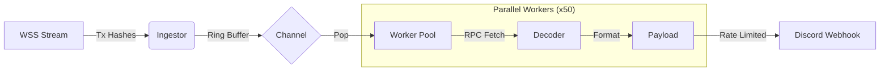

# mempool sniper

high-performance ethereum transaction monitoring system with real-time discord alerts

## overview

mempool sniper is a rust-based transaction monitoring tool that connects to ethereum nodes via websocket and alerts you instantly when transactions of interest appear in the mempool. currently deployed on sepolia testnet with full capture mode enabled.

**key features:**
- parallel worker architecture (50 concurrent workers)
- real-time discord webhook alerts with rich embeds
- automatic rate limiting (25 req/min) to prevent discord bans
- fail-open design (never crashes on single transaction errors)
- supports uniswap v2/v3, native transfers, and unknown methods
- full capture mode (processes 100% of transactions)

## architecture



**components:**
- **ingestor**: subscribes to pending transactions via websocket
- **consumer pool**: fetches full transaction details in parallel
- **decoder**: identifies swap methods and calculates effective value
- **discord client**: sends rate-limited alerts with etherscan links

## quick start

### prerequisites

- rust 1.70+ (2021 edition)
- infura account (or other ethereum rpc provider)
- discord webhook url

### installation

```bash
git clone https://github.com/bit2swaz/mempool-sniper.git
cd mempool-sniper
cargo build --release
```

### configuration

create a `.env` file in the project root:

```env
# ethereum rpc endpoint (sepolia testnet)
WSS_RPC_URL=wss://sepolia.infura.io/ws/v3/YOUR_PROJECT_ID

# discord webhook
DISCORD_WEBHOOK_URL=https://discord.com/api/webhooks/YOUR_WEBHOOK_ID/YOUR_TOKEN
USE_DISCORD=true
```

### running

```bash
# production mode (release build, info logs)
RUST_LOG=info cargo run --release --bin mempool-sniper

# debug mode (verbose logging)
RUST_LOG=debug cargo run --bin mempool-sniper

# test discord webhook without blockchain
cargo run --bin test_notification
```

## usage

### monitoring modes

**full capture mode (current default):**
processes every transaction on the network regardless of value or method. useful for research and complete network visibility.

**filtered mode (optional):**
uncomment value threshold checks in `src/main.rs` to filter by eth value. default threshold is 0.0001 eth.

### discord alerts

each alert contains:
- transaction value (eth)
- method name (swapexactethfortokens, native transfer, etc)
- etherscan link to transaction
- sender and recipient addresses
- detection timestamp (relative format)

**example alert:**
```
transaction detected

value: 10.5000 eth
method: swapexactethfortokens
transaction: 0x1234...cdef (clickable etherscan link)
from: 0xd8da...6045
to: 0xc02a...6cc2
detected: 2 seconds ago
```

### rate limiting

the discord client implements automatic rate limiting to prevent webhook bans:
- **limit**: 25 requests per minute (safety margin under discord's 30/min)
- **algorithm**: token bucket with minimum interval enforcement
- **behavior**: automatically throttles requests, no configuration needed

to adjust the rate limit, modify `RateLimiter::new()` in `src/discord.rs`:

```rust
// example: reduce to 15 requests per minute
rate_limiter: Arc::new(Mutex::new(RateLimiter::new(15)))
```

## performance

**observed metrics on sepolia testnet:**
- transaction detection latency: <500ms
- alert latency: <1s (when not rate limited)
- throughput: 5-15 tx/sec during active periods
- memory usage: ~50mb rss
- cpu usage: 15-25% single core

**websocket stability:**
- auto-reconnect with exponential backoff (1s, 2s, 4s, ..., max 60s)
- handles infura free tier instability gracefully
- "lagged by n messages" warnings are expected behavior

## project structure

```
src/
├── main.rs                  # main daemon + consumer loop
├── lib.rs                   # library exports
├── action.rs                # sniperaction trait + data structures
├── decoder.rs               # transaction decoding + selector matching
├── discord.rs               # discord webhook client + rate limiter
├── ingestor.rs              # websocket subscription management
└── bin/
    └── test_notification.rs # discord webhook test harness
```

## supported protocols

**uniswap v2:**
- swapexactethfortokens
- swapexacttokensforeth
- swapexacttokensfortokens

**uniswap v3:**
- exactinputsingle
- exactinput
- multicall

**other:**
- native eth transfers (empty calldata)
- unknown methods (any selector not in the list above)

## development

### testing

```bash
# run all unit tests
cargo test

# test discord webhook integration
cargo run --bin test_notification

# run in debug mode with full logging
RUST_LOG=trace cargo run --bin mempool-sniper
```

### build optimizations

the release profile is configured for maximum performance:

```toml
[profile.release]
lto = "fat"              # link-time optimization
codegen-units = 1        # single codegen unit
panic = "abort"          # no unwinding overhead
```

### code style

this project uses:
- lowercase log messages (no emojis or special characters)
- snake_case for variables and functions
- comprehensive error context with anyhow
- structured logging with tracing

## troubleshooting

### common issues

**websocket keeps disconnecting:**
- expected behavior on infura free tier
- system auto-reconnects, no action needed
- upgrade to paid tier for better stability

**discord rate limit errors:**
- reduce rate limit in `src/discord.rs` (lower than 25/min)
- enable filtering to reduce alert volume
- consider batching multiple transactions per alert

**high memory usage:**
- reduce channel capacity in `src/main.rs` (default 500k)
- reduce worker pool size (default 50)
- enable filtering to process fewer transactions

**"subscription not found" error:**
- rpc provider may not support eth_subscribe
- try different provider (infura, alchemy, quicknode)
- check wss_rpc_url format in .env

### logging

control log verbosity with rust_log:

```bash
# only errors
RUST_LOG=error cargo run

# info level (recommended)
RUST_LOG=info cargo run

# debug level (verbose)
RUST_LOG=debug cargo run

# trace everything (very verbose)
RUST_LOG=trace cargo run

# specific module debugging
RUST_LOG=mempool_sniper::discord=debug cargo run
```

## roadmap

### short-term
- [ ] web dashboard for alert history
- [ ] prometheus metrics exporter
- [ ] multi-webhook rotation for higher throughput
- [ ] configurable filtering via config file

### mid-term
- [ ] multi-chain support (polygon, arbitrum, base)
- [ ] postgresql database for historical analysis
- [ ] telegram bot integration
- [ ] advanced filtering dsl

### long-term
- [ ] machine learning for whale behavior prediction
- [ ] graph analysis of transaction networks
- [ ] custom rpc node for reduced latency
- [ ] real-time web ui with websocket streaming

## contributing

contributions welcome! please:
1. fork the repository
2. create a feature branch
3. write tests for new functionality
4. ensure `cargo test` passes
5. submit pull request with clear description

## license

mit license - see license file for details

## acknowledgments

- built with [alloy](https://github.com/alloy-rs/alloy) - modern ethereum library
- uses [tokio](https://tokio.rs/) for async runtime
- jemalloc allocator from [tikv](https://github.com/tikv/jemallocator)

## security

**important:** never commit your `.env` file or expose webhook urls publicly. the discord webhook url grants full access to send messages to your channel.

if you accidentally expose credentials:
- regenerate discord webhook immediately
- rotate infura api keys
- check git history and force push if needed

## support

- issues: [github issues](https://github.com/bit2swaz/mempool-sniper/issues)
- documentation: see [prd.md](PRD.md) for detailed technical specification

## disclaimer

this software is provided as-is for educational and research purposes. use at your own risk. the authors are not responsible for:
- financial losses from incorrect transaction interpretation
- discord webhook bans from misconfiguration
- rpc provider rate limiting or bans
- any other damages arising from use of this software

always test thoroughly on testnets before mainnet deployment.